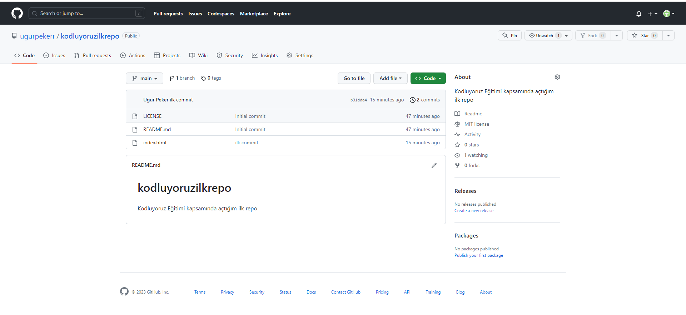

# KODLUYORUZİLKREPO

Bu repo [Kodluyoruz](www.kodluyoruz.com) Back-End Eğitiminde oluşturduğum ilk repo. İçerisinde bir adet README dosyası, bir adet de index.html barındırıyor. Ayrıca figures klasörü var ve içinde bir adet github adında png dosyası mevcut.



## INSTALLATION

Öncelikle projeyi clonelayın. (https://github.com/ugurpekerr/kodluyoruzilkrepo.git)

```bash
git clone https://github.com/ugurpekerr/kodluyoruzilkrepo.git
```

## USAGE

Projeyi cloneladıktan sonra Visual Studio Code programında açınız.

Linux için:
```linux
cd kodluyoruzilkrepo
code.
```

## CONTRIBUTING

Pull requestler kabul edilir. Büyük değişiklikler için, lütfen önce neyi değiştirmek istediğinizi tartışmak için bir konu açınız.

## LICENSE
[MIT](https://choosealicense.com/licenses/mit/)